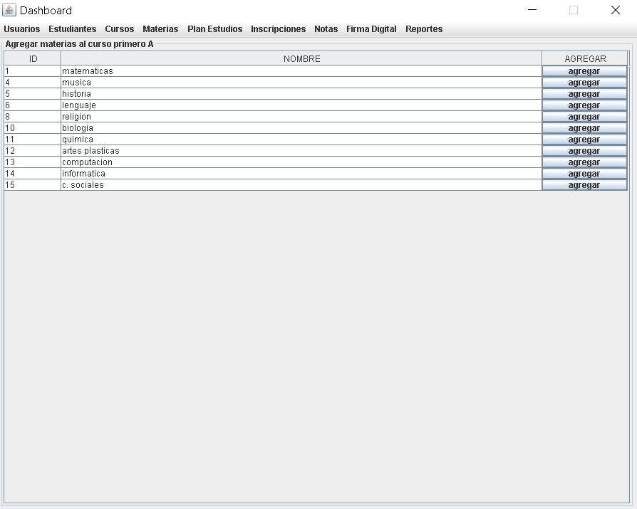
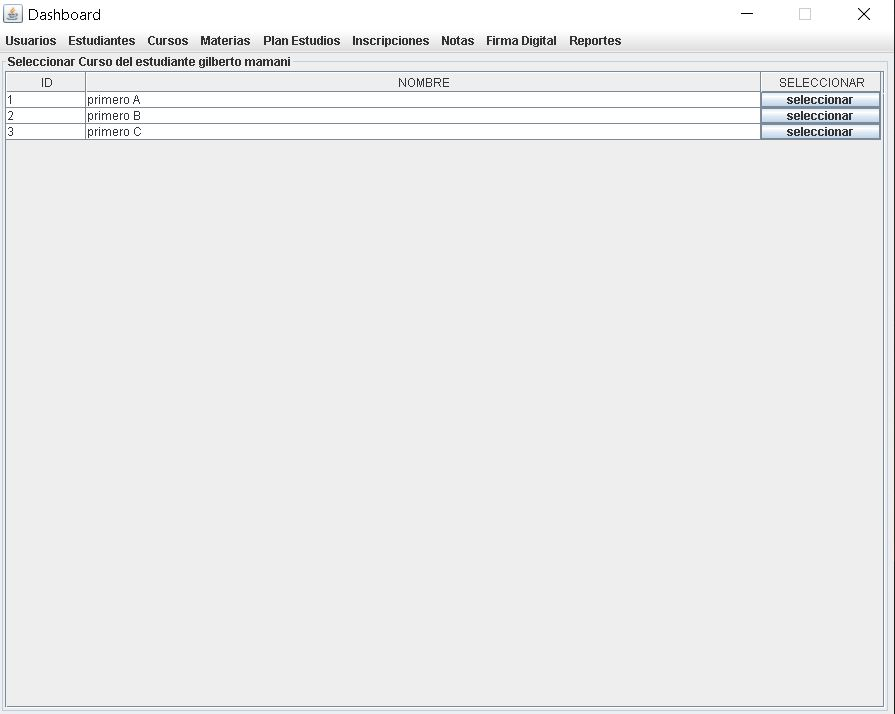

# java-swing-notas

This project using Gradle.

## Prerequisites 🔨

1. Install Windows 10
2. Install gradle-6.4.1
3. Install Java version 1.8.0_201
4. Install postgres:10
5. Optional install docker
6. Optional Clients: HeidiSQ, Dbeaver

Note: resolution recomented: 1920x1080

### Optional install postgres db in docker

```
docker pull postgres:10
docker run -d --name postgresdb -e POSTGRES_PASSWORD=secret123 -p 5432:5432 postgres:10
default user: postgres
default dbname: postgres
password: secret123
```

## Deploy / Installation 🔧

1. gradlew build

2. Execute all the queries in sql folder in your data bases.

- Create data bases.
- Create tables.
- Note: you should create a tables in public schema.

3. Config config.properties file.
4. java -jar build/libs/java-swing-notas.jar

## Diagrams

### Class Diagram

<p align="center">
  
</p>

### Use Case Diagram

<p align="center">
  
</p>

### Use Case Diagram Detailed

<p align="center">
  
</p>

### Entity Relation Data Base

<p align="center">
  
</p>

### Entity Relation Chen Notation Diagram

<p align="center">
  
</p>

### Entity Relation Crows Foot Diagram

<p align="center">
  
</p>

## UI Screens

### Login

<p align="center">
  
</p>

### Users

<p align="center">
  
</p>

<p align="center">
  
</p>

### Students

<p align="center">
  
</p>

<p align="center">
  
</p>

### Courses

<p align="center">
  
</p>

<p align="center">
  
</p>

### Subjects

<p align="center">
  
</p>

<p align="center">
  
</p>

### Study Plan

<p align="center">
  
</p>

<p align="center">
  
</p>

<p align="center">
  
</p>

### Inscriptions

<p align="center">
  
</p>

<p align="center">
  
</p>

<p align="center">
  
</p>

### Notes

<p align="center">
  
</p>

<p align="center">
  
</p>

<p align="center">
  
</p>

### Reports

### Reports By Course

<p align="center">
  
</p>

<p align="center">
  
</p>

<p align="center">
  
</p>

### Reports By Student

<p align="center">
  
</p>

<p align="center">
  
</p>

<p align="center">
  
</p>

## Contributing 🖇️

1. Fork it!
2. Create your feature branch: `git checkout -b feature/1001`
3. Commit your changes: `git commit -m 'feature/1001: Add some feature'`
4. Push to the branch: `git push origin feature/1001`
5. Submit a pull request.

## License 📄

- Free.
